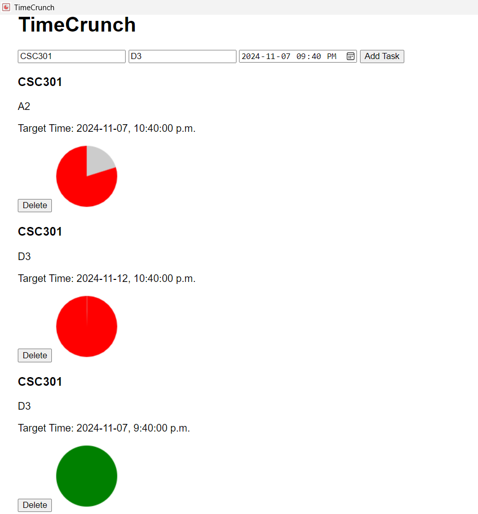

# TimeCrunch
Manage tasks efficiently with a visual timer.

## Screenshot


## Demo

This is 2 min video for public users.
For my grading, please refer to my 5 min video I submitted.

## App Platform
The app is designed to run on Windows, macOS, and Linux as a desktop application, using the Wails framework for cross-platform compatibility.
But I only tested it on Windows.

This is fully executable application, not a web app.

## Tech Stack
- **Backend**: Go
- **Frontend**: JavaScript, HTML, CSS
- **Build Tools**: Wails framework

## App Intro
**TimeCrunch** is a task management application designed to help users stay focused and avoid procrastination by adding visual timers. As users add tasks, a timer can be set for each, which visually shrinks over time to apply gentle pressure.

## Tool Intro
- **Wails**: [Wails](https://wails.io) is a framework that allows building desktop applications using Go for the backend and modern web technologies for the frontend.
- **Github Copilot, GPT-4o LLM**: Used for generating code snippets and suggestions during development. It also helped with writing boilerplate code for task management, frontend logic, and README (this file!).
- **Git**: Version control to manage and track code changes.

## Functionality
### What does your app do?
TimeCrunch is a task management app where users can:
- Add and delete tasks with descriptions.
- Set timers for each task to keep track of time spent.
- Receive visual cues (shrinking red circle) and auditory reminders to avoid procrastination.

### Who is the target audience?
Busy professionals, students, or anyone who needs a productivity tool to help them stay on track with tasks.

### What problem does it solve?
It helps users focus on tasks by giving visual and auditory reminders, preventing distractions and encouraging timely task completion.

It's advantage are simple usage and multiple visual cues instead of just a timer.

## Development Process
### How did you use AI tools to create the app?
I used **GitHub Copilot** to assist in generating code for task management (Go) and some frontend JavaScript logic. It helped with writing boilerplate code and gave suggestions for managing tasks, like creating `Task` structs and their associated methods.

Since I am learning Go, use of LLM was very helpful in writing Go code.
I exclusively used LLM to ask questions and get code snippets for Go code.

I started with good starting point of templates for both frontend and backend, where I had to make modifications to suit my needs.
Some of the Go syntax is still new to me, so Copilot also helped me with the auto-completion of Go code.

When it comes to design aspect, there's not much significant work needed for a task management app.

But I still got helped with the visual timer where circle shrinks over time.
If you take a look at main.js, you can see that I used LLM to get the code for visual timer with additional modifications to suit my needs.

In most cases, I had to re-ask multiple times to get the code that I wanted.

So overall, Copilot and LLM helped me in writing boilerplate code, frontend logic, and README.

### What specific tools did you use, and how did they assist you?
- **Copilot**: Provided code suggestions for implementing task management and frontend logic, speeding up development.
- **Wails**: Allowed for the seamless integration of the Go backend with a modern web-based frontend, providing a responsive desktop app environment.

## Usefulness
The app is beneficial for anyone who needs to manage tasks but tends to lose focus. The visual pressure mode and reminders help users maintain productivity, making it easier to track progress and stay on target.

I have been actively using this app to manage my tasks and found it helpful in staying focused and completing tasks on time.

Most importantly, it's a simple and easy-to-use tool that doesn't require a steep learning curve, making it accessible to a wide range of users.

Beside, now I don't have to use visual timer app on my phone. I prefer to use this on my desktop and this allows multiple tasks to be managed at once. Visual timer on phone only allows one task at a time.

## Installation and Execution

### Prerequisites
- **Go**: Install Go on your machine. You can download it from the [official Go website](https://golang.org/dl/).
- **Install Package**: Run the following command to install the Wails package:
```bash
go mod tidy
```
Ensure that you have the necessary dependencies installed on your machine:
- **Wails**: Install Wails on your machine. You can find installation instructions on the [Wails website](https://wails.io/docs/gettingstarted/installation).
- **GCC**: For Windows, you need to install GCC. You can download it from the [TDM-GCC website](https://jmeubank.github.io/tdm-gcc/).
- **Node.js**: Install Node.js on your machine. You can download it from the [official Node.js website](https://nodejs.org/).

### Development Mode
To run the app in development mode with live reloading:
```bash
cd TimeCrunch
wails dev
```

### Production Mode
To build the app for production:
```bash
cd TimeCrunch
wails build
```

### Running the Executable
After building the app, you can run the executable file generated in the `build` directory.

You can run executable file in build/bin/TimeCrunch.exe